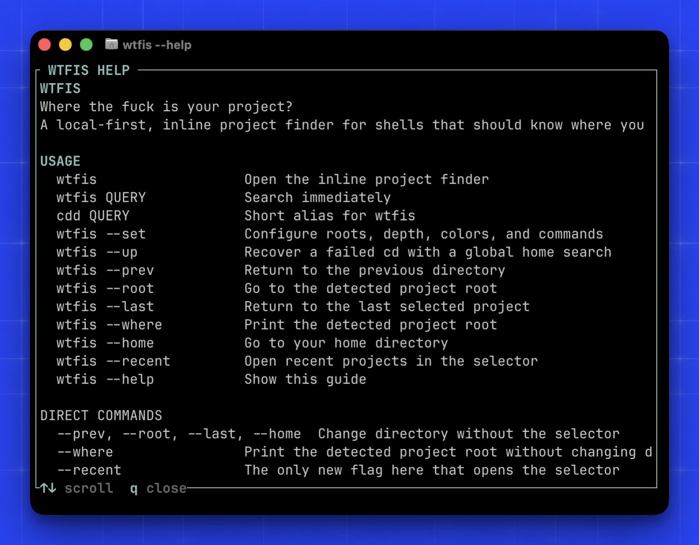

<p align="center">
  
</p>

<p align="center">
  <a href="https://www.rust-lang.org/"></a>
  <a href="https://github.com/prophesourvolodymyr/WTFIS-CLI/actions/workflows/ci.yml"></a>
  <a href="https://github.com/prophesourvolodymyr/WTFIS-CLI/releases"></a>
  <a href="https://github.com/prophesourvolodymyr/WTFIS-CLI/blob/main/LICENSE"></a>
  <a href="https://github.com/prophesourvolodymyr/homebrew-wtfis"></a>
  
  
  
</p>

<h1 align="center">Find your fucking Folder.</h1>

<p align="center">A local-first terminal finder for getting back to the folder you meant.</p>

`wtfis` finds folders from a name, path, or typo. `cdd` is the short alias. Pick a match, press Enter, and your shell goes there.

## See it work

<p align="center"><a href="#install">Don't Care - Download this Fucker Now</a></p>

### Easy as fuck commands


Like swearing? Type `wtfis`. In a hurry? `cdd`.

### Rich TUI


Search locally, pick the right folder, get back to work.

### Built-in commands


Use `cdd` to find a folder. Add a command if you want WTFIS to run something after `cd`.

### Productivity shortcuts



Use `--up`, `--prev`, and `--recent` when you are tired of retracing your path.

### Settings


Tell WTFIS where to look, how far to look, and what to run after it finds something.

## Install

###  macOS

**Homebrew**

```bash
brew tap prophesourvolodymyr/wtfis
brew install wtfis
cat "$(brew --prefix)/share/wtfis/wtfis.zsh" >> ~/.zshrc
source ~/.zshrc
```

For Bash:

```bash
echo 'source "$(brew --prefix)/share/wtfis/wtfis.bash"' >> ~/.bashrc
source ~/.bashrc
```

**Manual:** download `wtfis-macos-arm64.tar.gz` from [Releases](https://github.com/prophesourvolodymyr/WTFIS-CLI/releases/latest).

###  Linux

**Homebrew**

```bash
brew tap prophesourvolodymyr/wtfis
brew install wtfis
echo 'source "$(brew --prefix)/share/wtfis/wtfis.bash"' >> ~/.bashrc
source ~/.bashrc
```

For Zsh:

```bash
echo 'source "$(brew --prefix)/share/wtfis/wtfis.zsh"' >> ~/.zshrc
source ~/.zshrc
```

**Arch Linux / AUR**

Package name: `wtfis-cli` (AUR publication pending).

```bash
yay -S wtfis-cli
```

**Manual:** download `wtfis-linux-x86_64.tar.gz` from [Releases](https://github.com/prophesourvolodymyr/WTFIS-CLI/releases/latest).

###  Windows

**Scoop**

```powershell
scoop bucket add wtfis https://github.com/prophesourvolodymyr/homebrew-wtfis
scoop install wtfis
. "$env:USERPROFILE\scoop\apps\wtfis\current\shell\wtfis.ps1"
```

For future sessions:

```powershell
Add-Content $PROFILE '. "$env:USERPROFILE\scoop\apps\wtfis\current\shell\wtfis.ps1"'
```

**Manual:** download `wtfis-windows-x86_64.zip` from [Releases](https://github.com/prophesourvolodymyr/WTFIS-CLI/releases/latest).

<p align="center">
  <a href="https://buymeacoffee.com/professorvolodymyr"></a>
</p>

## Use

```bash
wtfis                    # open inline search
wtfis my-project         # search immediately
cdd my-project           # short alias
wtfis --set              # configure search roots
wtfis --up               # recover a failed cd with a global search
wtfis --prev             # return to the previous directory
wtfis --root             # go to the detected project root
wtfis --last             # return to the last selected project
wtfis --where            # print the detected project root
wtfis --home             # go to your home directory
wtfis --recent           # open recent projects in the selector
wtfis /opencode          # cd to the selected project and run opencode
wtfis my-project /opencode # search a project, then run a command
wtfis --help             # open the inline command guide
```

`--prev`, `--root`, `--last`, and `--home` skip the selector and change directories directly. `--where` prints the detected project root. `--recent` opens your recent folders.

On first run, WTFIS shows a short introduction and opens setup for search roots and preferences.

WTFIS uses local fuzzy matching and searches the folders you care about by default. Use `wtfis --set` to add roots, change depth, or turn on broader recovery. It does not upload your paths or project data.

Run `wtfis` with no query and it opens straight into your recent folders. It starts scanning when you type.

Type `/` in the selector for command presets. `/add` attaches a preset or custom command to a folder. `/exit` backs out. `/opencode` and similar commands enter the folder and run straight away. Configure presets with `wtfis --set`.

`wtfis --help` lists every command and control. Inside the finder, use Up/Down and Enter, press Escape to cancel, or click a result. Trackpad and mouse-wheel scrolling are ignored there on purpose. A clear fuzzy match opens directly; close calls stay in the selector.

The Rust core runs on macOS, Linux, and Windows. Linux uses Bash or Zsh integration. Windows uses the PowerShell wrapper to change the parent shell directory.

`exact_depth` sets the maximum search depth. With `roots = ["/Users/you/GSpace"]` and `exact_depth = 3`, WTFIS checks the first three layers below that root. Shallow matches rank first, but an exact name still wins deeper down.

## Development

```bash
cargo test
cargo run -- my-project
```

## License

WTFPL
